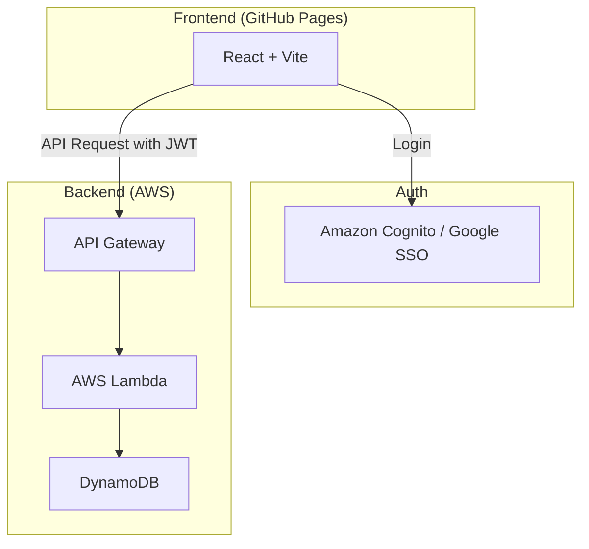

# 名称
家庭用品在庫管理アプリ

## 目的
家庭の日用品の在庫を効率的に管理し、無くなる日を予測することで、買い忘れや買いすぎを防ぎます。

## Features

- **品目管理**:
  - ユーザーが自由に品目を追加・編集・削除できます。
  - 各品目に対して、購入単位（個、パック、本など）を自由に設定できます。
- **在庫記録**:
  - 現在の在庫数を記録・更新できます。
  - 追加購入した品目の数量と購入日を記録できます。
- **消費状況の可視化**:
  - 品目ごとの消費履歴をグラフなどで確認できます。
- **在庫切れ予測**:
  - 消費状況に基づいて、在庫が無くなる日を推定し、ユーザーに提示します。
- **通知機能**:
  - 在庫切れが近づいた品目について、通知（検討中）を行うことができます。

## Tech Stack

| 技術 | 名称 | 説明 |
| :---: | :--- | :--- |
|  | **React** | ユーザーインターフェース構築のためのJavaScriptライブラリ。最新のv19を使用。 |
|  | **Vite** | 高速なビルドツールおよび開発サーバー。 |
|  | **DynamoDB** | フルマネージドなNoSQLデータベース。品目や在庫情報を格納。 |
|  | **AWS Lambda** | サーバーレスなイベント駆動型コンピューティングサービス。 |
|  | **Serverless Framework** | サーバーレスアプリケーションの構成・デプロイを管理するフレームワーク。 |
|  | **Amazon Cognito** | Google SSO認証を提供するID管理サービス。 |
|  | **Amazon Polly** | テキストをリアルな音声に変換するクラウドサービス。（現時点では利用予定なし、構成は引き継ぐ） |
|  | **GitHub Actions** | CI/CD（継続的インテグレーション/継続的デプロイ）を自動化。 |
|  | **Vitest** | Viteネイティブで高速なユニットテストフレームワーク。 |

## Architecture

### System Architecture

### Screen Transitions

### Authentication

本アプリは Google アカウントによる SSO（シングルサインオン）認証を採用しています。

- **認証プロバイダー**: Amazon Cognito + Google OAuth 2.0
- **仕組み**:
  1. ユーザーが Google アカウントでログイン。
  2. Cognito が JWT（JSON Web Token）を発行。
  3. フロントエンドは API リクエストの `Authorization` ヘッダーにこのトークンを含めて送信。
  4. バックエンド（API Gateway / Lambda）でトークンの有効性を検証し、ユーザーID（`sub`）を特定。

### Backend API (AWS Lambda)

| 関数名 | パス | メソッド | 説明 |
| :--- | :--- | :--- | :--- |
| createItem | `/items` | POST | 新しい品目を登録する。 |
| getItems | `/items` | GET | 登録されているすべての品目を取得する。 |
| updateItem | `/items/{itemId}` | PUT | 品目情報を更新する。 |
| deleteItem | `/items/{itemId}` | DELETE | 品目を削除する。 |
| addStock | `/items/{itemId}/stock` | POST | 品目の在庫を追加する。 |
| consumeStock | `/items/{itemId}/consume` | POST | 品目の在庫を消費する。 |
| getConsumptionHistory | `/items/{itemId}/history` | GET | 品目の消費履歴を取得する。 |
| getEstimatedDepletionDate | `/items/{itemId}/estimate` | GET | 品目の在庫切れ推定日を取得する。 |

### Database (DynamoDB)

#### 1. household-items
家庭用品の品目情報を格納するテーブル。

| 属性名 | 型 | キー | 説明 |
| :--- | :--- | :--- | :--- |
| itemId | String | Partition Key | 品目の一意識別子 (UUID) |
| name | String | - | 品目名 |
| unit | String | - | 単位（例: 個, パック, 本） |
| currentStock | Number | - | 現在の在庫数 |
| createdAt | String | - | 作成日時 (ISO8601) |
| updatedAt | String | - | 更新日時 (ISO8601) |

#### 2. stock-history
品目の購入・消費履歴を格納するテーブル。

| 属性名 | 型 | キー | 説明 |
| :--- | :--- | :--- | :--- |
| historyId | String | Partition Key | 履歴の一意識別子 (UUID) |
| itemId | String | Sort Key | 品目ID |
| type | String | - | 履歴の種類（"purchase", "consumption"） |
| quantity | Number | - | 数量 |
| date | String | - | 日付 (ISO8601) |
| memo | String | - | メモ (任意) |

## CI/CD Pipeline Specification

詳細な CI/CD パイプラインの仕様については、[CI/CD Pipeline Specification](docs/cicd-pipeline-specification.md) を参照してください。

## 運用

### バックアップと復旧

本システムでは、データの保護と可用性向上のため、以下のバックアップ体制をとっています。

- **DynamoDB Point-in-Time Recovery (PITR)**:
  - すべてのテーブル（`household-items`, `stock-history`, `polly-cache`）において PITR を有効化しています。
  - 過去 35 日間の任意の時点にデータを復旧することが可能です。
  - 意図しないデータ削除や更新ミスが発生した際の保険として機能します。
