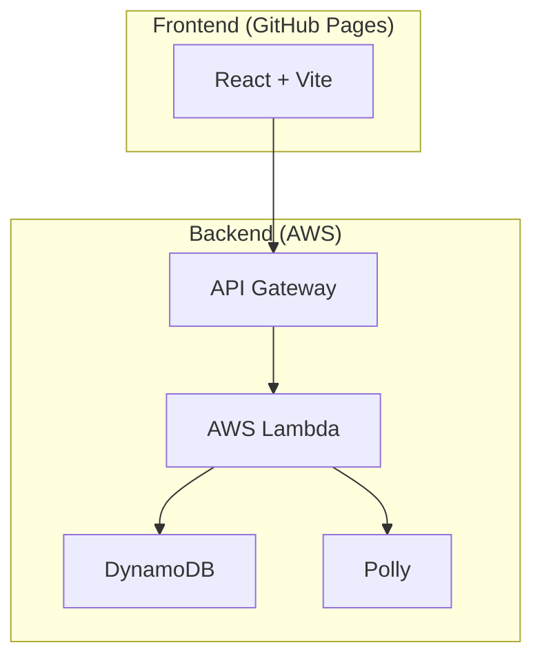
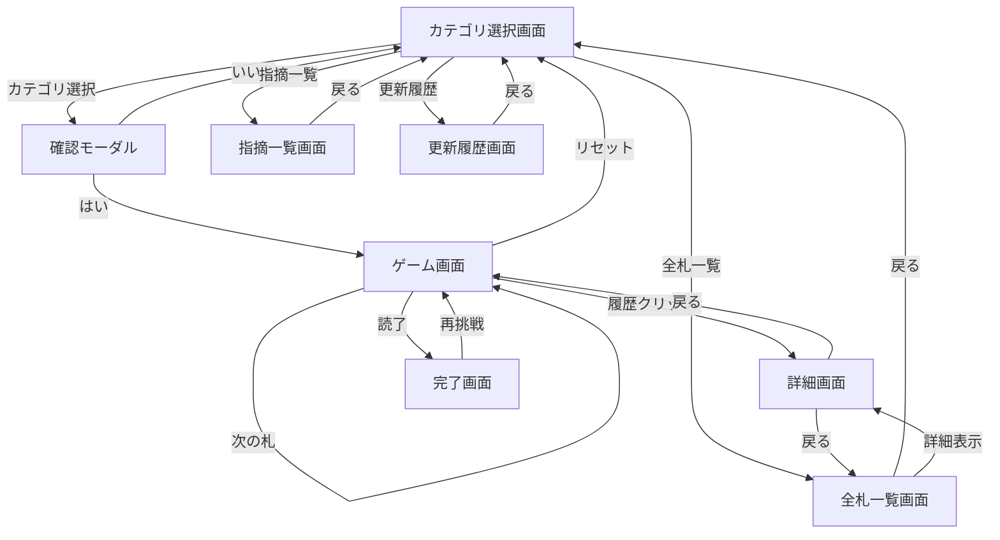

# karuta
かるた読み上げアプリ

## 目的
かるたの読み上げをアプリで行うことで、全員がかるたに参加すること。

## Features

- **フレーズ読み上げ**:
  - 指定されたカテゴリのフレーズをランダムに取得し、Amazon Pollyを利用して音声を生成します。
  - 英語と日本語に対応しており、読み上げ速度の調整が可能です。
  - 読み上げ回数や平均タイム、平均難易度を記録します。
- **カテゴリ管理**:
  - 登録されているフレーズのカテゴリを一覧で取得します。
- **コメント機能**:
  - 各フレーズに対してコメントを投稿し、表示することができます。
- **お祝いメッセージ**:
  - 全てのフレーズを読み終えると、お祝いのメッセージが音声で再生されます。
- **フレーズ一覧**:
  - 登録されているフレーズを一覧で確認できます。

## Tech Stack

| 技術 | 名称 | 説明 |
| :---: | :--- | :--- |
|  | **React** | ユーザーインターフェース構築のためのJavaScriptライブラリ。最新のv19を使用。 |
|  | **Vite** | 高速なビルドツールおよび開発サーバー。 |
|  | **DynamoDB** | フルマネージドなNoSQLデータベース。フレーズや統計情報を格納。 |
|  | **AWS Lambda** | サーバーレスなイベント駆動型コンピューティングサービス。 |
|  | **Serverless Framework** | サーバーレスアプリケーションの構成・デプロイを管理するフレームワーク。 |
|  | **Amazon Polly** | テキストをリアルな音声に変換するクラウドサービス。 |
|  | **GitHub Actions** | CI/CD（継続的インテグレーション/継続的デプロイ）を自動化。 |
|  | **Vitest** | Viteネイティブで高速なユニットテストフレームワーク。 |

## Architecture

### System Architecture

### Screen Transitions

### Backend API (AWS Lambda)

| 関数名 | パス | メソッド | 説明 |
| :--- | :--- | :--- | :--- |
| getCategories | `/get-categories` | GET | 登録されているカテゴリの一覧を取得する。 |
| getPhrasesList | `/get-phrases-list` | GET | 指定したカテゴリ（または全カテゴリ）のフレーズ一覧を取得する。 |
| getPhrase | `/get-phrase` | GET | 指定したIDまたはランダムなフレーズを取得し、Pollyで音声を生成（またはキャッシュから取得）して返す。 |
| getCongratulationAudio | `/get-congratulation-audio` | GET | 全フレーズ終了時のお祝いメッセージ音声を生成して返す。 |
| recordTime | `/record-time` | POST | 読み上げに対する回答時間と難易度を記録し、統計情報を更新する。 |
| postComment | `/post-comment` | POST | フレーズに対して新しいコメントを投稿する。 |
| getComments | `/get-comments` | GET | 全てのコメントを取得し、新着順にソートして返す。 |

### Database (DynamoDB)

#### 1. karuta-phrases
読み上げ用フレーズを格納するテーブル。

| 属性名 | 型 | キー | 説明 |
| :--- | :--- | :--- | :--- |
| category | String | Partition Key | カテゴリ名 |
| id | String | Sort Key | フレーズの一意識別子 |
| phrase | String | - | 読み上げテキスト（日本語） |
| phrase_en | String | - | 読み上げテキスト（英語） |
| kana | String | - | フレーズの読み（かな） |
| level | String/Number | - | 難易度レベル |
| readCount | Number | - | 読み上げられた回数 |
| averageTime | Number | - | 平均回答時間（秒） |
| averageDifficulty | Number | - | ユーザーが選択した平均難易度 |

#### 2. karuta-comments
各フレーズに対するユーザーコメントを格納するテーブル。

| 属性名 | 型 | キー | 説明 |
| :--- | :--- | :--- | :--- |
| id | String | Partition Key | コメントID (UUID) |
| phraseId | String | - | 対象フレーズのID |
| category | String | - | 対象フレーズのカテゴリ |
| phrase | String | - | 対象フレーズのテキスト |
| comment | String | - | コメント内容 |
| createdAt | String | - | 作成日時 (ISO8601) |

#### 3. karuta-polly-cache
Amazon Polly で生成した音声データのキャッシュ。

| 属性名 | 型 | キー | 説明 |
| :--- | :--- | :--- | :--- |
| id | String | Partition Key | キャッシュID (ハッシュ値) |
| audioData | String | - | Base64形式の音声データ |
| createdAt | String | - | 作成日時 (ISO8601) |

## CI/CD Pipeline Specification

詳細な CI/CD パイプラインの仕様については、[CI/CD Pipeline Specification](docs/cicd-pipeline-specification.md) を参照してください。

## かるた情報の追加・更新

かるたの情報（フレーズや難易度など）は、以下の手順で追加・更新できます。

1. `backend/phrases.csv` を編集します。
   - `category`: かるたのカテゴリ名
   - `id`: 一意のID
   - `phrase`: 読み上げテキスト
   - `kana`: 読み（かな）
   - `phrase_en`: 英語テキスト（任意）
   - `level`: 難易度（数値または `-`）
2. 変更を `main` ブランチにコミット＆プッシュします。
3. GitHub Actions の CD ワークフローが自動的に実行され、DynamoDB のデータが更新されます。
   - 既存のアイテムの統計情報（読み上げ回数や平均時間）は維持されます。
   - CSV から削除されたアイテムは、データベースからも削除されます。
