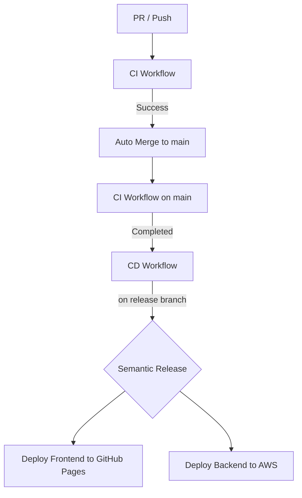

# CI/CD Pipeline Specification

本プロジェクトでは GitHub Actions を利用して CI/CD パイプラインを構築しています。

## Architecture



## 1. CI ワークフロー (`ci.yml`)
- **トリガー**:
  - `main` または `release` ブランチへのプッシュ
  - 全てのプルリクエスト
- **実行内容**:
  - `commitlint`: コミットメッセージが Conventional Commits 形式に従っているか検証
  - `frontend-test`: フロントエンドの Lint、ビルド、および Vitest によるテスト
  - `backend-test`: バックエンドの Vitest によるテスト
  - `merge`: PR の場合、テスト成功後に `main` ブランチへ自動マージ（Squash merge）

## 2. CD ワークフロー (`cd.yml`)
- **トリガー**:
  - `main` または `release` ブランチへのプッシュ
  - CI ワークフローの成功完了（`workflow_run`）
- **実行内容**:
  - `release`: `semantic-release` によるバージョン自動採番、タグ付け、および `CHANGELOG.md` の更新
  - `build-and-deploy-frontend`: フロントエンドをビルドし、GitHub Pages へデプロイ
  - `deploy-backend`: バックエンドを Serverless Framework を使用して AWS Lambda へデプロイ

## 3. リリース運用
- **リリース条件**:
  - `semantic-release` による実際のタグ付けとデプロイは、**`release` ブランチへのマージ（プッシュ）時にのみ**実行されます。
  - `main` ブランチは開発用であり、保護設定による権限エラーを避けるため、自動リリースはスキップされます。
- **リリースの手順**:
  1. 通常の開発は `main` ブランチに対して行い、PR を作成してマージします。
  2. リリースの準備ができたら、`main` ブランチを `release` ブランチにマージします。
  3. `release` ブランチでの CI 成功後、自動的にリリースおよびデプロイが行われます。

 
# Release → Main 自動同期 PR（CI スキップ運用）について

このリポジトリでは、`release` ブランチと `main` ブランチの差分を  
**GitHub Actions により自動で Pull Request 作成 → 自動マージ** しています。

この PR は **コードレビューや CI を目的としない「同期専用 PR」** です。

そのため、通常の開発 PR とは異なるブランチ保護ルールが必要になります。

---

## 目的

- `release` ブランチでのリリース作業を `main` に安全に反映する
- semantic-release によるタグ管理を壊さない
- CI を走らせずに即時マージする
- Bot による完全自動運用を可能にする

---

## 前提

- `release` → `main` の PR は **GitHub Actions（Bot）** が作成
- 人間によるレビュー・修正は想定しない
- CI が不要、または `[skip ci]` が付与される

---

## 必須設定（GitHub リポジトリ側）

### 1. Auto-merge を有効化

**Settings → General → Pull Requests**

- ✅ Allow auto-merge

---

### 2. Branch rules（Ruleset）の設定

**Settings → Rules → Rulesets**

`main` ブランチに対して、以下のルールを設定してください。

---

## Require a pull request before merging

✅ **ON**

> main への直接 push を防ぎ、必ず PR 経由にする

---

## Review 関連（すべて OFF）

| 項目 | 設定 |
|---|---|
| Required approvals | **0** |
| Dismiss stale pull request approvals | OFF |
| Require review from specific teams | OFF |
| Require review from Code Owners | OFF |
| Require approval of the most recent reviewable push | OFF |
| Require conversation resolution before merging | OFF |

### 理由

- Bot PR に人間レビューを要求すると **自動マージ不能**
- 同期目的のためレビュー自体が不要

---

## Status checks（CI）

❌ **Require status checks to pass** → OFF

### 理由

- 同期 PR は CI を目的としない
- CI が存在しない / skip されるケースを許容するため

---

## Allowed merge methods

✅ **Allow squash merging（推奨）**

❌ Allow merge commits  
❌ Allow rebase merging  

### 理由

- `main` に不要な履歴を残さない
- 「同期」という意図が 1 コミットで明確になる
- semantic-release の解析が安定する

---

## Bypass list（重要）

### 推奨設定

以下のいずれかを **Bypass list** に追加してください。

- `github-actions[bot]`
- または 使用している GitHub App / Bot

### 理由

- ブランチ制限を Bot が回避できないと PR 作成・マージに失敗する

---

## ワークフロー側の注意点

### PR 作成アクション例

```yaml
- name: Create PR from release to main
  uses: peter-evans/create-pull-request@v5
  with:
    token: ${{ secrets.GITHUB_TOKEN }}
    base: main
    head: release
    title: "Sync release branch into main"
    body: "Automated PR to sync release changes into main."
    commit-message: "chore: sync release branch into main [skip ci]"

