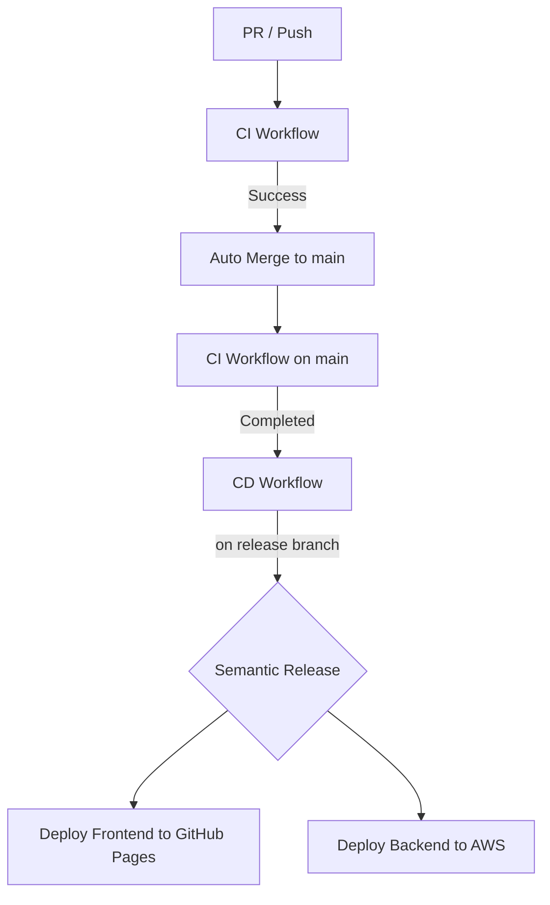

# CI/CD Pipeline Specification

本プロジェクトでは GitHub Actions を利用して CI/CD パイプラインを構築しています。

## 目次
- [1. パイプライン概要](#1-パイプライン概要)
- [2. CI ワークフロー (ci.yml)](#2-ci-ワークフロー-ciyml)
- [3. CD ワークフロー (cd.yml)](#3-cd-ワークフロー-cdyml)
- [4. リリース運用](#4-リリース運用)
- [5. 環境変数](#5-環境変数)
- [6. Release → Main 自動同期](#6-release--main-自動同期)
- [7. GitHub ブランチ保護ルール](#7-github-ブランチ保護ルール)

---

## 1. パイプライン概要

---

## 2. CI ワークフロー (`ci.yml`)
- **トリガー**:
  - `main` または `release` ブランチへのプッシュ
  - 全てのプルリクエスト
- **実行内容**:
  - `commitlint`: コミットメッセージが Conventional Commits 形式に従っているか検証。
  - `frontend-test`: フロントエンドの Lint、ビルド、および Vitest によるテスト
  - `backend-test`: バックエンドの Vitest によるテスト
  - `merge`: PR の場合、テスト成功後に `main` ブランチへ自動マージ（Squash merge）

---

## 3. CD ワークフロー (`cd.yml`)
- **トリガー**:
  - `main` または `release` ブランチへのプッシュ
  - CI ワークフローの成功完了
- **実行内容**:
  - `release`: `semantic-release` によるバージョン自動採番、タグ付け、および `CHANGELOG.md` の更新
  - `build-and-deploy-frontend`: フロントエンドをビルドし、GitHub Pages へデプロイ
  - `deploy-backend`: バックエンドを Serverless Framework を使用して AWS Lambda へデプロイ
    - デプロイ前に DynamoDB の破壊的変更チェックと自動バックアップを実行します。

---

## 4. リリース運用
- **リリース条件**:
  - `semantic-release` による実際のタグ付けとデプロイは、**`release` ブランチへのマージ（プッシュ）時にのみ**実行されます。
- **コミットメッセージのルール (Conventional Commits)**:
  - 自動リリースと `CHANGELOG.md` 生成のため、ルールを厳守してください。

---

## 5. 環境変数

| 変数名 | 説明 | 例 |
|---|---|---|
| `AWS_ACCESS_KEY_ID` | AWSアカウントへのアクセスキーID | `AKI*****************` |
| `AWS_SECRET_ACCESS_KEY` | AWSアカウントへのシークレットアクセスキー | `****************************************` |
| `GITHUB_TOKEN` | GitHub APIへのアクセスに使用されるトークン | `ghp_**********************************` |
| `GEMINI_API_KEY` | 自動コーディングに用いるGeminiのトークン | `*********************************` |

---

## 6. Release → Main 自動同期

`release` ブランチでのリリース作業を `main` に安全に反映するため、GitHub Actions により自動で Pull Request 作成 → 自動マージを行っています。

---

## 7. GitHub ブランチ保護ルール

`main` ブランチに対して、以下のルールを設定してください。

### Pull Request マージの必須化
- main への直接 push を防ぎ、必ず PR 経由にします。

### ステータスチェック（CI）
- 同期 PR の円滑なマージのため、Bot によるバイパス設定を推奨します。

### マージ方法
- **Allow squash merging** を推奨。
