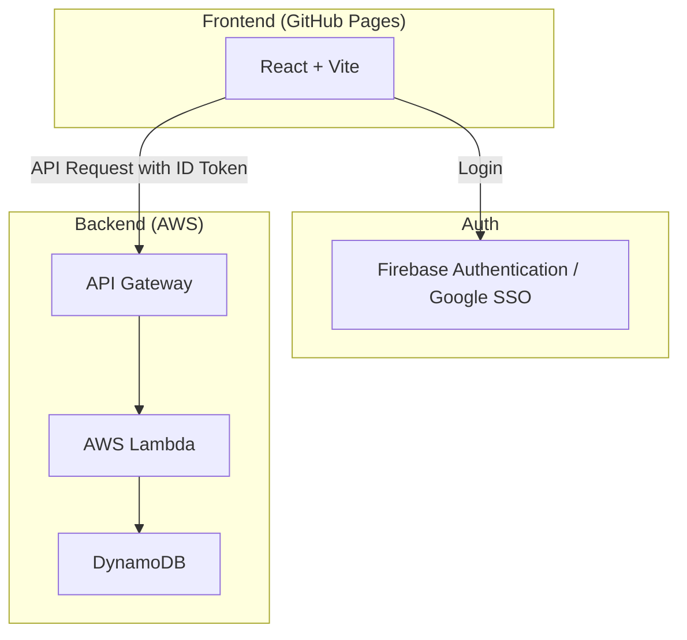
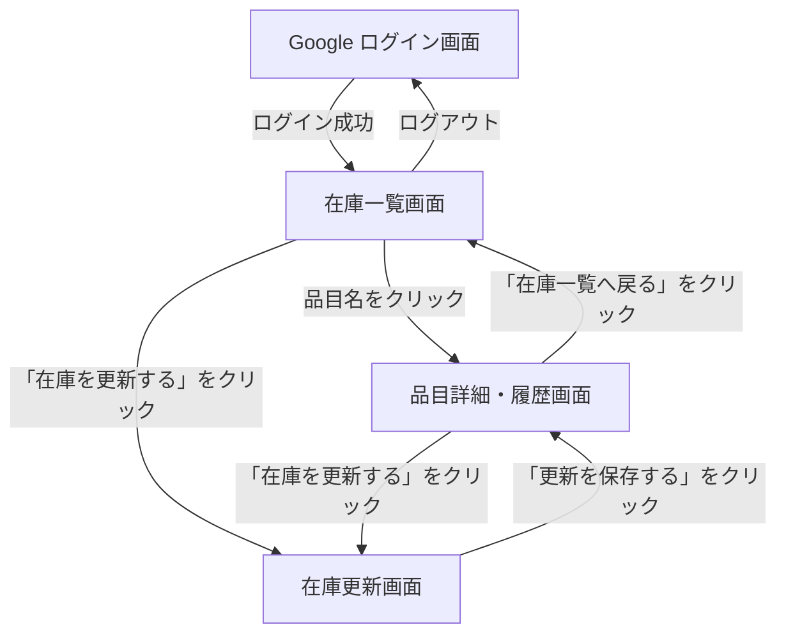

# 内部設計書 (Internal Design)

本ドキュメントでは、「うちストック」のバックエンドにおける主要なロジックおよび設計判断について詳述します。

## 目次
- [1. ユーザー識別とセキュリティ](#1-ユーザー識別とセキュリティ)
- [2. 在庫予測アルゴリズム](#2-在庫予測アルゴリズム)
- [3. データベース整合性](#3-データベース整合性)
- [4. 履歴の種類と定義](#4-履歴の種類と定義)
- [5. システム構成 (Architecture)](#5-システム構成-architecture)
- [6. データベース設計 (Database Design)](#6-データベース設計-database-design)

---

## 1. ユーザー識別とセキュリティ

### ユーザー特定ロジック
バックエンド（`handler.js`）では、以下の優先順位でユーザーID（`userId`）を特定します。

1.  **Firebase ID Token**: `Authorization: Bearer <token>` ヘッダーから取得。`firebase-admin` SDKを使用してトークンを検証し、UIDを取得します。また、この時に取得されるメールアドレスや表示名などのプロフィール情報は、`users` テーブルに自動的に同期されます。
2.  **テストモード**: `x-user-id: test-user` が指定されている場合、認証なしでアクセスを許可します。これはログイン未済のユーザーが試用するための仕様です。
3.  **開発用 fallback**: `x-user-id` ヘッダー。開発およびローカルテスト環境での利便性のために維持（`ALLOW_INSECURE_USER_ID=true` または `NODE_ENV=test` の場合のみ有効）。

### セキュリティ上の注意
本番環境では必ず Firebase ID Token による検証を行います。`FIREBASE_SERVICE_ACCOUNT` 環境変数にサービスアカウントキーを設定する必要があります。

---

## 2. 在庫予測アルゴリズム

在庫切れ予測は、過去の消費実績に基づき、現在の在庫がいつ枯渇するかを推定します。

### 平均消費ペースの算出 (`calculateAverageConsumptionRate`)
消費イベント（`consumption`）の履歴から日次平均消費量を計算します。

-   **観測期間**: 最初の消費記録日時から現在（`new Date()`）までの期間。
-   **計算式**: `総消費量 / 観測期間（日）`
-   **制約**:
    -   最低2件の消費履歴が必要。
    -   計算された値は品目テーブルの `averageConsumptionRate` 属性にキャッシュされ、消費イベントのたびに更新される。

### 在庫切れ推定日の計算 (`getEstimatedDepletionDate`)
APIリクエスト時の「基準日（デフォルトは現在）」における在庫状況を予測します。

1.  **予測在庫の算出**:
    -   最後に在庫が確定したイベント（購入、消費、更新）からの経過日数を計算。
    -   `予測在庫 = 現在の在庫数 - (平均消費ペース * 経過日数)`
2.  **推定日の算出**:
    -   `残りの日数 = 予測在庫 / 平均消費ペース`
    -   `推定日 = 基準日 + 残りの日数`

### 在庫割合 (`stockPercentage`) の算出
現在の予測在庫が、基準となる在庫量（最後に購入した数量、または直近の在庫設定値）に対して何％残っているかを計算します。UIでの進捗バーや警告表示に使用されます。

---

## 3. データベース整合性

### 在庫更新の原子性
在庫の追加（`addStock`）や消費（`consumeStock`）は、以下の2ステップで行われますが、現状は個別のSDKコールとなっています。
1.  `stock-history` テーブルへの履歴追加 (`PutCommand`)
2.  `household-items` テーブルの `currentStock` 更新 (`UpdateCommand`)

*将来的な改善点*: 整合性を厳格に保つため、DynamoDB Transactions (`TransactWriteItems`) への移行を検討します。

---

## 4. 履歴の種類と定義

| 種類 (type) | 発生タイミング | 用途 |
| :--- | :--- | :--- |
| `creation` | 品目の新規登録時 | 初期データの追跡 |
| `purchase` | 在庫の追加時 | 在庫割合の基準値として使用 |
| `consumption` | 在庫の消費時 | 消費ペース計算の母集団 |
| `update` | 在庫数の直接編集時 | 在庫数の強制同期 |

---

## 5. システム構成 (Architecture)

### システム構成図

### 画面遷移図

### 画面一覧

| 画面名 | パス | 説明 |
| :--- | :--- | :--- |
| 在庫一覧 | `/` | 登録されている品目の一覧、現在の在庫数、および在庫切れ予想日を表示します。 |
| 品目詳細・履歴 | `/item/{itemId}` | 特定の品目の詳細情報と、これまでの在庫変動履歴（購入・消費）を表示します。 |
| 在庫更新 | `/item/{itemId}/update` | 在庫数の追加（購入）や消費を記録し、現在の在庫数を更新します。 |

---

## 6. データベース設計 (Database Design)

### 1. household-items
家庭用品の品目情報を格納するテーブル。

| 属性名 | 型 | キー | 説明 |
| :--- | :--- | :--- | :--- |
| userId | String | Partition Key | ログインユーザーID (Firebase UID) |
| itemId | String | Sort Key | 品目の一意識別子 (UUID) |
| name | String | - | 品目名 |
| unit | String | - | 単位（例: 個, パック, 本） |
| currentStock | Number | - | 現在の在庫数 |
| createdAt | String | - | 作成日時 (ISO8601) |
| updatedAt | String | - | 更新日時 (ISO8601) |

### 2. stock-history
品目の購入・消費履歴を格納するテーブル。

| 属性名 | 型 | キー | 説明 |
| :--- | :--- | :--- | :--- |
| itemId | String | Partition Key | 品目ID |
| date | String | Sort Key | 日付 (ISO8601) |
| userId | String | - | ログインユーザーID |
| historyId | String | - | 履歴の一意識別子 (UUID) |
| type | String | - | 履歴の種類（"purchase", "consumption"） |
| quantity | Number | - | 数量 |
| memo | String | - | メモ (任意) |

### 3. users
ユーザーのプロフィール情報を管理するテーブル。デバッグのしやすさの向上および将来の共有機能（お友達登録）のために使用されます。

| 属性名 | 型 | キー | 説明 |
| :--- | :--- | :--- | :--- |
| userId | String | Partition Key | ログインユーザーID (Firebase UID) |
| email | String | GSI (EmailIndex) | メールアドレス |
| displayName | String | - | 表示名 |
| photoURL | String | - | プロフィール画像URL |
| updatedAt | String | - | 最終同期日時 (ISO8601) |
